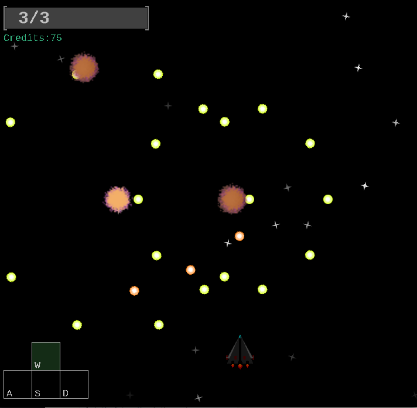
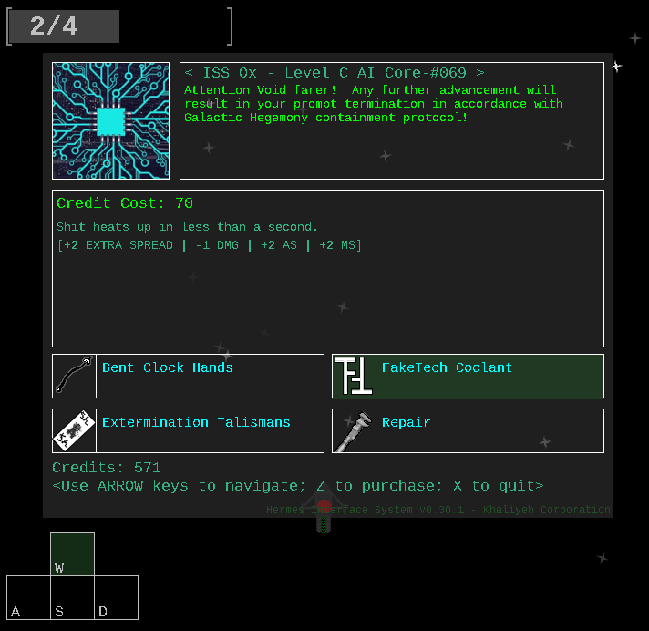
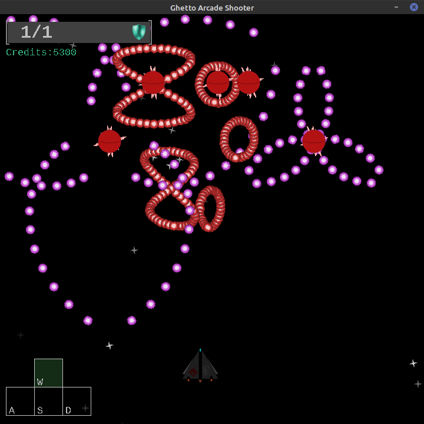
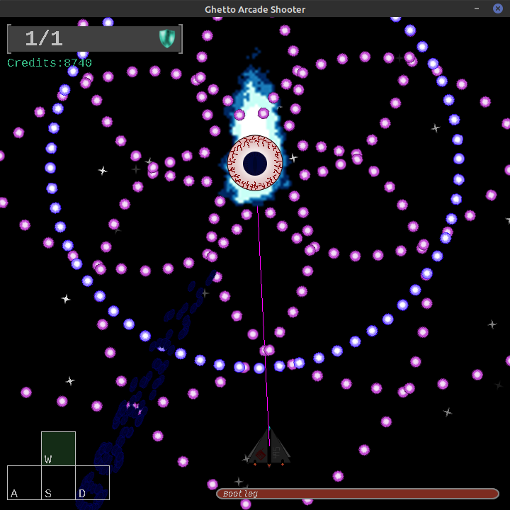

# ICS Culminating Rewrite Source Code

The source code for the rewrite of an ICS final project: a game.  Originally written in 2018, the rewrite aims to mix together randomized RPG-like items with the STG genre while making the overall game run better.

Audio is handled by [TinySound](https://github.com/finnkuusisto/TinySound) and YAML parsing is handled by [snakeyaml](https://bitbucket.org/asomov/snakeyaml/src/master/).  Other than that, the rest of the game's engine is built using Java's built-in packages.

Game assets have been redacted since most of them are placeholders.  Only a handful were made by hand, but are not necessarily quality enough to warrant putting them up.

## Controls

* WASD - Movement
* Space - Hitbox and Speed Toggle
* Z - Shoot (game) and select (menu and shop)
* X - Activate item effect (game); exit shop (game) and return (menu)

## Demo Videos

Project as it was when submitted for the ICS final (Recorded on low-end PC):
https://www.youtube.com/watch?v=etXuU62qonA

Project now (Using Placeholder Assets):
https://www.youtube.com/watch?v=iH0YtjXuUBg

## Preview (Placeholder Assets)

